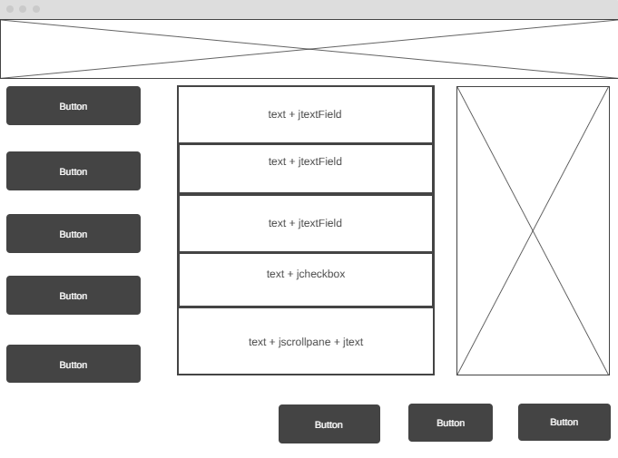
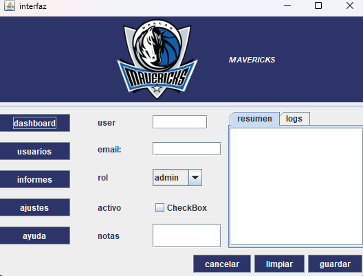

# Gestor de Usuarios – Ejercicio Tema 2: “Paneles y Layouts como profesionales”

## 📌 Descripción
Este proyecto consiste en diseñar e implementar una interfaz gráfica en **Java Swing** a partir de un wireframe y un esquema de contenedores. El objetivo es **aprender a utilizar correctamente los paneles y layouts de Swing** (BorderLayout, FlowLayout, GridLayout y GridBagLayout), aplicando buenas prácticas de organización de la interfaz y asegurando que el diseño sea **flexible al redimensionar** la ventana.

---

## 📝 Planificación inicial

### Wireframe
El wireframe inicial muestra la estructura general de la aplicación "Gestor de usuarios":

- **Header (NORTH)**: título + icono.
- **Lateral (WEST)**: menú de navegación con 5 botones.
- **Centro (CENTER)**: formulario de usuario con campos de texto, comboBox, checkbox y área de texto.
- **Derecha (EAST)**: panel de previsualización con un `JTabbedPane` (pestañas “Resumen” y “Logs”).
- **Inferior (SOUTH)**: botonera de acciones (`Cancelar`, `Limpiar`, `Guardar`) alineada a la derecha.

📷 Captura del wireframe:  


---
📷 Captura interfaz:

### Árbol de contenedores
La interfaz se organizó de la siguiente manera:

```
JFrame (BorderLayout)
 ├─ NORTH: headerPanel (FlowLayout)
 │    └─ JLabel (icono + título)
 │
 ├─ WEST: navPanel (GridLayout 5x1)
 │    ├─ JButton Dashboard
 │    ├─ JButton Usuarios
 │    ├─ JButton Informes
 │    ├─ JButton Ajustes
 │    └─ JButton Ayuda
 │
 ├─ CENTER: formPanel (GridBagLayout)
 │    ├─ JLabel + JTextField (Nombre)
 │    ├─ JLabel + JTextField (Email)
 │    ├─ JLabel + JComboBox (Rol)
 │    ├─ JLabel + JCheckBox (Activo)
 │    └─ JLabel + JScrollPane(JTextArea) (Notas)
 │
 ├─ EAST: previewPanel (BorderLayout)
 │    └─ JTabbedPane
 │         ├─ Tab “Resumen” → JScrollPane + JTextArea
 │         └─ Tab “Logs” → JList
 │
 └─ SOUTH: buttonBar (FlowLayout RIGHT)
      ├─ JButton Cancelar
      ├─ JButton Limpiar
      └─ JButton Guardar
```

---

## ⚙️ Construcción en IntelliJ GUI Designer

### 1) Root Panel
- `BorderLayout` para dividir la ventana en zonas principales.

### 2) Header (NORTH)
- `FlowLayout` con un `JLabel` (icono + texto “Gestor de usuarios”).
- Fuente personalizada (negrita, tamaño 18).
- Opcional: `JSeparator` para dividir header y contenido.

### 3) Navegación (WEST)
- `GridLayout` con 5 filas, 1 columna (`rows=5, cols=1, vgap=5`).
- 5 `JButton`: Dashboard, Usuarios, Informes, Ajustes, Ayuda.
- Propiedades: mismo tamaño horizontal.

### 4) Formulario (CENTER)
- `GridBagLayout` para máxima flexibilidad.
- Uso de `insets = (5,5,5,5)` para márgenes.
- Configuración de `weightx=1` en columnas de campos.
- Alineación `anchor = WEST` en etiquetas.
- `fill=HORIZONTAL` en campos y `fill=BOTH` en área de texto.

### 5) Previsualización (EAST)
- `BorderLayout` con un `JTabbedPane` en el centro.
- Pestaña 1: “Resumen” → JTextArea dentro de JScrollPane (solo lectura).
- Pestaña 2: “Logs” → JList de usuarios invitados.
- Preferred Size ≈ 260px de ancho.

### 6) Botonera (SOUTH)
- `FlowLayout` con alineación `RIGHT`.
- Botones: Cancelar, Limpiar, Guardar.
- Propiedades: mismo tamaño horizontal.
- Botón por defecto: Guardar.

---

## 📂 Archivos entregados

- `interfaz.java` → Lógica de la ventana principal.
- `interfaz.form` → XML generado por IntelliJ GUI Designer con los layouts y componentes.
- `README.md` → Planificación, explicación del diseño, capturas y criterios de evaluación.

---

## ✅ Criterios de evaluación

1. **Estructura / layouts elegidos (3 pts)**  
   Uso correcto de BorderLayout, FlowLayout, GridLayout y GridBagLayout.

2. **Uso de propiedades de distribución (3 pts)**  
   Aplicación de insets, hgap/vgap, anchor, fill, weightx/weighty, preferred size.

3. **Comportamiento al redimensionar (2 pts)**  
   - El formulario y notas crecen.  
   - El panel EAST mantiene tamaño fijo.  
   - Botonera alineada a la derecha.

4. **Presentación / README (2 pts)**  
   Wireframe, árbol de paneles, capturas y explicación clara.

---

## 🚀 Mejoras opcionales
- Añadir `JMenuBar` con menús Archivo / Editar / Ayuda.
- Cambiar la botonera a `GridLayout(1,3)` y comparar con Flow RIGHT.
- Usar `gridwidth=2` en el campo Notas para practicar spans.

---

## 👨‍💻 Autor
Práctica de interfaz en Swing – Tema 2.  
Asignatura: Desarrollo de Interfaces.
